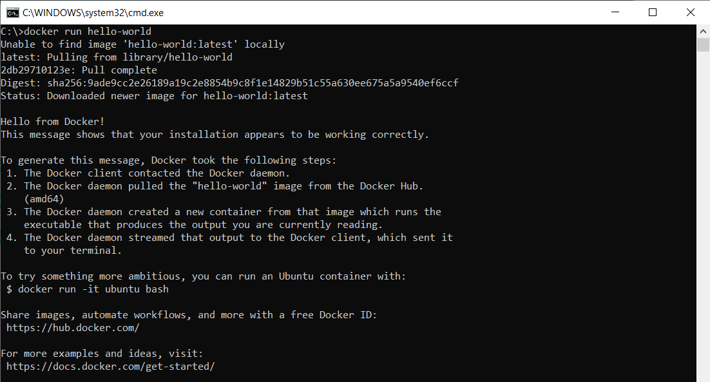
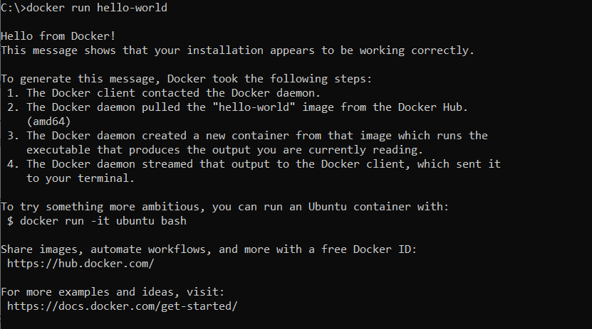

## Docker

### Installation
Docker is free for personal use.   Go here to signup and then download/install the software.
https://www.docker.com/products/personal

### What is Docker?
If you're familiar with IT in general, then you are likely very familiar with the limitations that come with
running a process on a non-dedicated machine (your laptop, or a shared virtual machine or server).  Docker
is the equivalent of having a PC that is configured to run a specific program, and then taking a backup
of that entire system (Image).   When you need to run a process, you restore the backup to run that process (Container).
You copy some input files, and then run a script, and then copy the output files, and then teardown the PC so it is ready
to be used for another process.  

But what if we could have the equivalent of 15-20 dedicated PCs all working from one physical machine?   That is the power
of Docker images.   But then what if you had 50 PCs available, but it would take days/hours to restore a backup to
them to run 50 files at a time?   The promise/guarantee from Docker is that it will run EXACTLY the same no matter
what PC you run it on (Windows 2000, Windows 10/11, MacOS, Linux, 1TB Ram or 8GB of Ram it really doesn't matter).

### A simple example
This example is going to download an image (basically a tape backup) of a Linux operating system (very low memory usage).
Docker will restore that image, and then run it as a Container.   In this case all this image does is run a simple bash
script that prints "Hello World" to the screen, and then it terminates.

If you can image having an extra PC, formatting the hard drive.  Creating a boot disk, and then installing a Linux
distribution.  Creating an initial username/password, and then handwriting a script.   That whole process is completed
in a single, one line command here.

Type this in a command prompt (or bash terminal if on Mac/Linux).

```docker run hello-world```



When you run that command Docker first looks on your local machine to see if you have an image named hello-world saved in
your library.  Once it doesn't find it, it then goes out to the public repository (Docker.io by default) to find an image 
named hello-world.  Then it downloads the image (backup), and then it runs the image which just prints a "Hello from Docker!" 
message.    And then the Container (the name of a running instance of an Image).

Now that you have a copy of the hello-world image, try to run the command again.  Now you will see that since you already have
a hello-world image on your local machine, the command runs much faster and it doesn't need to go out and look for it in any
remote repositories.

