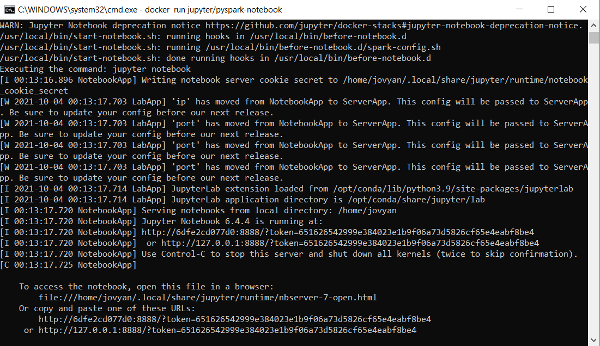
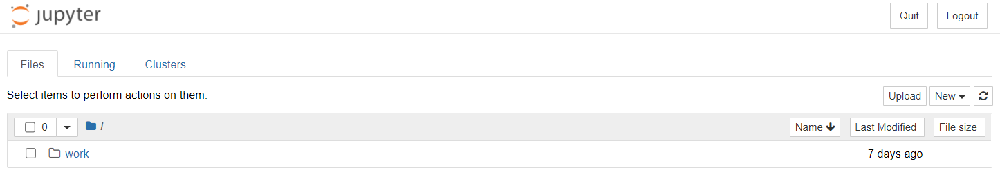
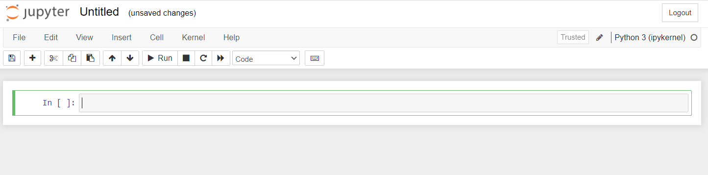
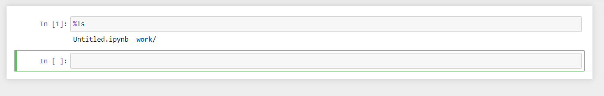

#Using Jupyter
Since this tutorial is about actually using Python, Spark, and Jupyter
we can skip the process of downloading/installing python, java, and all
the dependencies by simply using a Docker image someone else put together.

##Command line
The pull command will only download a copy of the image.  It does not run 
the image as a container.
```
docker pull jupyter/pyspark-notebook
```
If you would like information on the available jupyter images you can view the [documentation](https://jupyter-docker-stacks.readthedocs.io/en/latest/index.html).

After downloading, then run the image.

```
docker run -it --rm -p 8888:8888 jupyter/pyspark-notebook
```
A quick breakdown of this command.
<br />```docker run``` tells Docker to run an image as a container.
<br />```-it``` Runs the container with an Interactive Terminal so we can see the debug messages from Jupyter.
<br />```--rm``` Delete the container after it exists.  By default Docker will save a copy of every container just in case you wanted to restart it.
<br />```-p 8888:8888``` Exposes the container's port 8888 to the host pc's port 8888.  If your host PC is already using port 8888, you can map it to any other available port your would like such as 12345 by amending the command to ```-p 8888:12345```.
<br />There are many, many more options available in the Docker run command.  For a complete list visit the [Documentation](https://docs.docker.com/engine/reference/commandline/run/)

When it starts you will see quite a bit of text printed to the terminal window.  At the bottom you should see a link that looks something like http://127.0.0.1:8888/?token=651626542999e384023e1b9f06a73d5826cf65e4eabf8be4.  Your token will be different everytime you start a notebook.  Just copy the full link, and paste it in your browser.



##Web Browser
Once you visit the link in the browser, you should see a folder/file listing.


##Creating a notebook
Click the new button that is to the far right of the screen, and then Python3 Notebook.  You should see a blank/empty notebook, and you will be in the first cell.


###Notebook cells
There are two types of cells.   A cell can either be a Markdown cell for documentation using the Markdown standard, or it can be a code cell which can run Python code or some system commands.  The toolbar offers buttons for basic commans such as adding another cell, or moving a cell up/down or changing the cell from Code to Markdown.  

If you need to list files in the directory for instance you can type ```%ls``` and then click run.  The % sign tells Jupyter you want to run a system command, and ls is a command to just list the current directory's contents (keep in mind this image is based on Linux and not Windows so ```%dir``` will not work.
